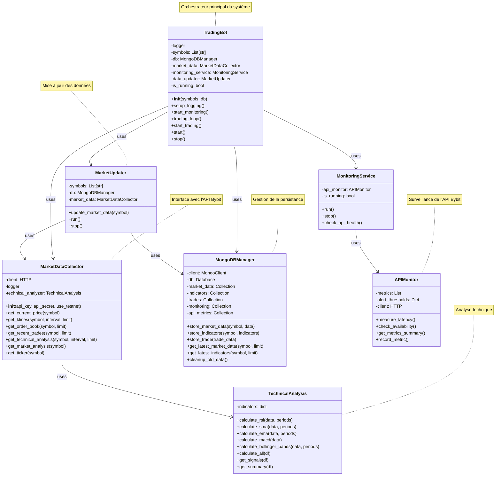
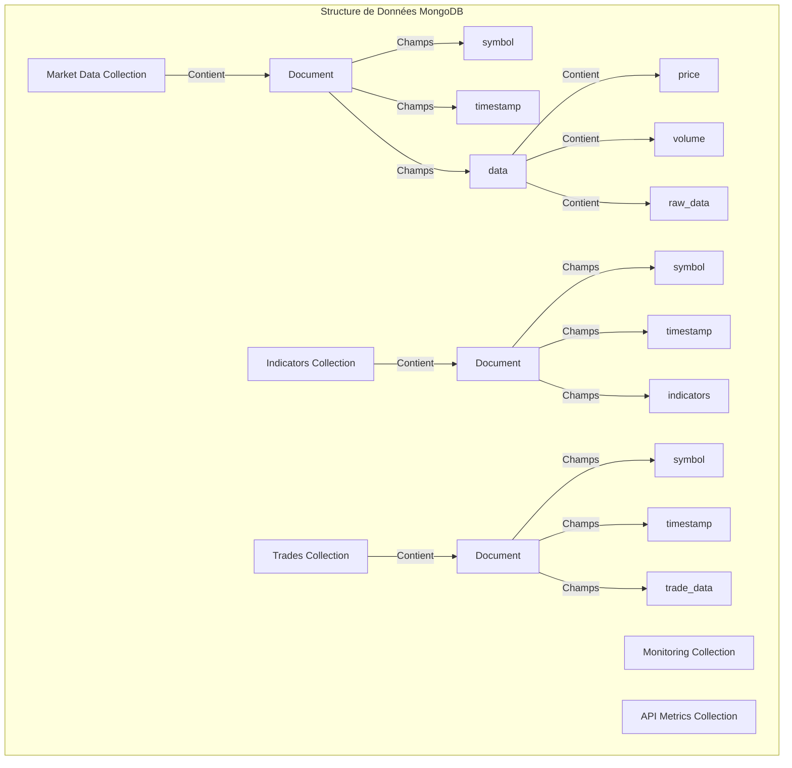

# Architecture du Trading Bot Bybit

## Vue d'ensemble du système

## Structure des Données

## Description des Composants

### TradingBot
- Composant central qui orchestre tout le système
- Gère les cycles de trading et la coordination des services
- Maintient l'état global du système
- Gère les threads de trading, monitoring et mise à jour des données

### MarketDataCollector
- Interface directe avec l'API Bybit
- Collecte les données de marché en temps réel
- Intègre l'analyse technique via TechnicalAnalysis
- Gère les formats de données spécifiques à Bybit

### TechnicalAnalysis
- Calcule les indicateurs techniques (RSI, MACD, Bollinger Bands)
- Fournit des signaux de trading
- Analyse les tendances du marché
- Génère des résumés d'analyse technique

### MongoDBManager
- Gère toutes les opérations de base de données
- Maintient plusieurs collections pour différents types de données
- Gère le nettoyage et l'optimisation des données
- Fournit des méthodes d'accès standardisées

### APIMonitor & MonitoringService
- Surveille la santé de l'API Bybit
- Mesure la latence et la disponibilité
- Gère les alertes et les métriques
- Assure la fiabilité du système

### MarketUpdater
- Met à jour les données de marché périodiquement
- Coordonne la collecte et le stockage des données
- Gère les erreurs de mise à jour
- Maintient la fraîcheur des données