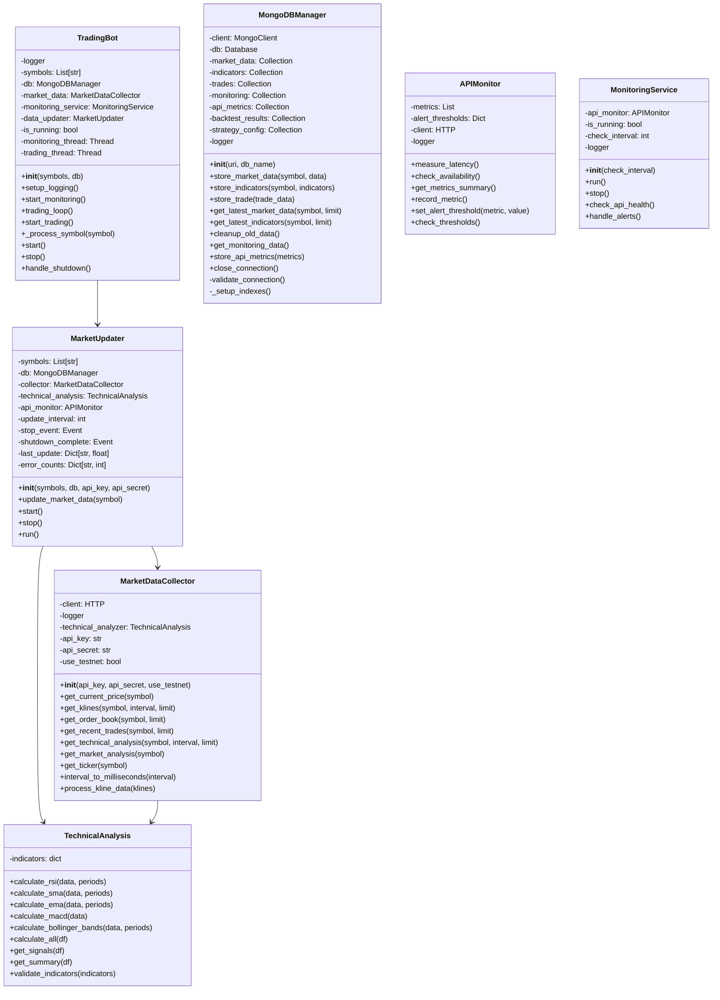

# Architecture du Trading Bot Bybit

## Vue d'ensemble du système

## Composants Principaux

### TradingBot
- Point d'entrée principal du système
- Gère le cycle de vie du bot et la coordination des services
- Implémente le pattern Singleton pour garantir une seule instance
- Utilise _process_symbol pour la mise à jour optimisée des données

### MarketUpdater
- Gère les mises à jour périodiques des données de marché
- Implémente un système de déduplication des mises à jour
- Maintient un timestamp de dernière mise à jour par symbole
- Gère les erreurs avec un système de comptage et retry
- Assure un arrêt propre avec shutdown_complete

### Interaction entre les composants
1. TradingBot initialise MarketUpdater avec les symboles configurés
2. MarketUpdater gère de manière autonome les mises à jour périodiques
3. TradingBot peut demander des mises à jour via _process_symbol
4. La déduplication assure qu'une seule mise à jour est effectuée dans l'intervalle configuré

## Optimisations
1. Déduplication des mises à jour :
   - Utilisation de timestamps pour éviter les mises à jour trop fréquentes
   - Coordination entre TradingBot et MarketUpdater
   
2. Gestion des erreurs :
   - Comptage des erreurs par symbole
   - Système de retry avec backoff
   - Logs détaillés pour le debugging

3. Performance :
   - Réduction des appels API inutiles
   - Optimisation des intervalles de mise à jour
   - Meilleure utilisation des ressources

## Structure des Données

## Description des Composants

### TradingBot
- Composant central qui orchestre tout le système
- Gère les cycles de trading et la coordination des services
- Maintient l'état global du système
- Gère les threads de trading, monitoring et mise à jour des données
- Implémente une gestion gracieuse de l'arrêt
- Logging détaillé des opérations

### MarketDataCollector
- Interface directe avec l'API Bybit
- Collecte les données de marché en temps réel
- Intègre l'analyse technique via TechnicalAnalysis
- Gère les formats de données spécifiques à Bybit
- Conversion des intervalles temporels
- Traitement et validation des données brutes

### TechnicalAnalysis
- Calcule les indicateurs techniques (RSI, MACD, Bollinger Bands)
- Fournit des signaux de trading
- Analyse les tendances du marché
- Génère des résumés d'analyse technique
- Validation des indicateurs calculés
- Support pour des périodes personnalisées

### MongoDBManager
- Gère toutes les opérations de base de données
- Maintient plusieurs collections pour différents types de données:
  * market_data: Données de marché brutes
  * indicators: Indicateurs techniques calculés
  * trades: Historique des trades
  * monitoring: Données de surveillance système
  * api_metrics: Métriques de l'API
  * backtest_results: Résultats des backtests
  * strategy_config: Configuration des stratégies
- Gère le nettoyage et l'optimisation des données
- Fournit des méthodes d'accès standardisées
- Validation des connexions
- Gestion propre des fermetures de connexion
- Logging des opérations de base de données
- Configuration via variables d'environnement
- Mise en place automatique des index pour l'optimisation

### APIMonitor & MonitoringService
- Surveille la santé de l'API Bybit
- Mesure la latence et la disponibilité
- Gère les alertes et les métriques
- Assure la fiabilité du système
- Seuils d'alerte configurables
- Intervalle de vérification paramétrable
- Logging des événements de monitoring

### MarketUpdater
- Met à jour les données de marché périodiquement
- Coordonne la collecte et le stockage des données
- Gère les erreurs de mise à jour avec système de retry configurable
- Maintient la fraîcheur des données
- Gestion gracieuse de l'arrêt avec timeout
- File d'attente pour les opérations de shutdown
- Configuration flexible des API keys
- Validation des données de marché
- Caractéristiques supplémentaires :
  * Suivi des erreurs par symbole via error_counts
  * Intervalle de mise à jour configurable (update_interval)
  * Nombre maximum de tentatives paramétrable (max_retries)
  * Vérification de la santé de l'API avant chaque mise à jour
  * Traitement des données avec pandas DataFrame
  * Intégration avec le système de monitoring
  * Gestion des timeouts et des arrêts propres
  * Support du mode testnet